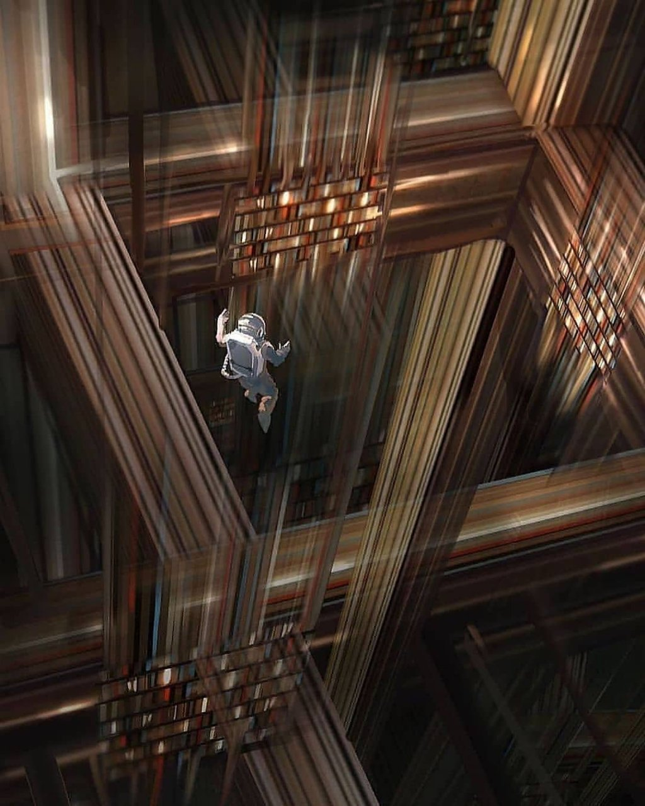

從理性面來看，生養小孩完全沒有好處，常在想有沒有一個值得分享的好處~~麻痺自己，讓自己不要顯得那麼狼狽~~，畢竟絕大多數都是痛苦跟疲累...XD

之前聽到[台通 EP209](https://anchor.fm/taiwanfirstcommuter/episodes/EP209--ft-e1jqmuj/a-a83g7u6) 火鳥於 1:05:20 左右的分享，覺得挺有共鳴：

> 原來人生有一張重活一次的卡片，全部可以用小孩的眼睛，完全體會世界一次。
>
> 找到腦中右時的記憶，我以前也蹲這麼低看世界，我以前也會畫畫在褲子上、牆上，好快樂不會被罵。
>
> 只是因為我想畫畫，沒有牆的問題，沒有紙的問題，那是大人的事情，他們可以到處畫畫。

我也有類似的體驗，生養小孩可以得到的好處（或特殊體驗）是，可以再重活一次。

---

特別強烈的印象是，在第二個小孩一歲左右，開始往高處探索時，我**同時**得到四種身分的體驗：

### 當下身為父親的自己
匆忙地放下手邊事物，跑到孩子身邊確保他不會發生危險，觀察他到底想幹嘛。

### 我的父親照顧自己的心情
從我父親的視角，看見過去一歲時的自己，理解自己有多麼欠揍，理解我父親是如何愛我。

### 一歲時的自己
回到過去，看到做著相同動作所看到的風景，重新沉浸自己探索的情境及樂趣。

### 從我孩子的視角，看到他所看到的樂趣
在當下跟著孩子的視角移動，尋常的的櫃子變得好高好有趣，一起體驗他所得到的樂趣。

---

其他類似情境還有，看著孩子拿著剪刀亂剪各種東西時，孩子手中的觸感可以傳到自己身上，同時想起當初破壞東西的快感!

所以我忍住沒有去阻止，有機會孩子可能從他的孩子再體驗一次。

這種體驗，在平穩地觀察孩子們時很容易出現，腦中畫面一幕幕出現；而我還沒有在其他情境中體驗過。

類似星際效應裡，主角穿越黑洞時掉入第五度空間，可以同時看到不同時空的場景。

我是覺得還挺酷的，趁還有機會時多嗑點，不然虧大了。

不知道有沒有其他育兒者有相同的經驗？